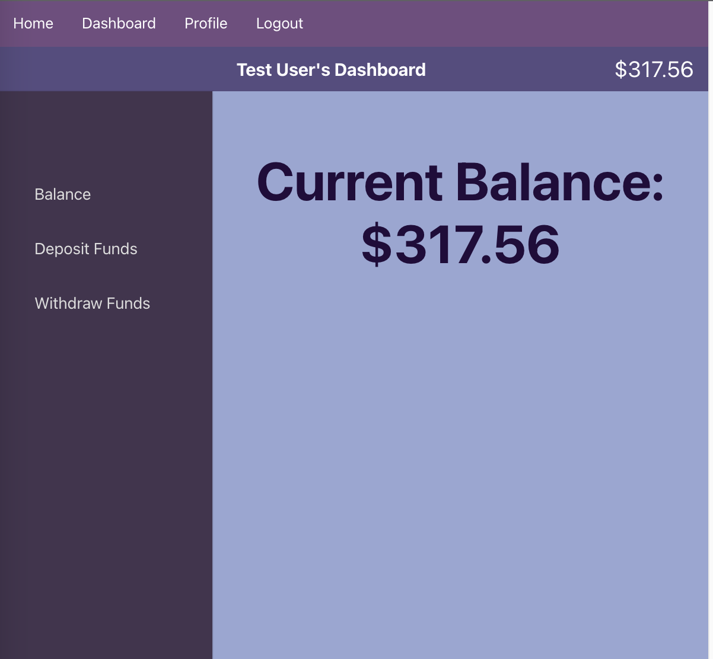

# Mitchell Marino Take Home Assignment

## Roadies Labs

Assignment: Build a simple application with a login/logout feature and a dashboard for the user to see their account balance. React is required for frontend.

<hr>

### Technologies used

#### FrontEnd:

<li>React.js</li>
<li>React-router-dom</li>
<li>Axios</li>
<li>JWT-decode</li>
<br>

#### Backend:

<li>Node</li>
<li>MongoDB</li>
<li>Express</li>
<li>Mongoose</li>
<li>Bcrypt</li>
<li>JsonWebToken</li>

<hr>

### Summary

To deploy the backend, I used Node and Express with MongoDB. In the database, there is a User Model as follows:

| User Model |                                |
| ---------- | ------------------------------ |
| name:      | string                         |
| email:     | string                         |
| password:  | string (encrypted with bcrypt) |
| balance:   | integer                        |

The backend routes were created as follows:

| Action | Route          | Description                               |
| ------ | -------------- | ----------------------------------------- |
| POST   | /user/register | Register a new user                       |
| POST   | /user/login    | Login a new user                          |
| GET    | /user          | Get information of current user           |
| PUT    | /user          | Update current user's information         |
| PUT    | /user/balance  | Update the current user's account balance |

#### Notes:

Passwords are encrypted using bcrypt. Upon successful login/registration, the backend responds with a JWT token packaging the user's info. This token expires after 1 day. All routes (except login/register) require the token as an authorization header. This ensures that a user can only access/update the data they own.

To deploy the frontend, I used React.js with React-router-dom. Upon user registration/login on the frontend, the JWT token is stored in localstorage. The frontend is mobile-responsive and was styled using vanilla CSS.

### Screenshot:



## Installation Instructions

To run this program locally, first fork and clone this repository. Open up the repository in your terminal and run the following commands:

```
// set up client
cd client

echo "REACT_APP_SERVER_URL=http://localhost:8000" > .env.local

npm install

// set up server
cd ../server

echo "JWT_SECRET=SuperDuperSecretCode123454321" > .env

npm install
```

Once these commands are run, the program is ready to run locally. Navigate back to the client folder, run `npm start` to get started.
